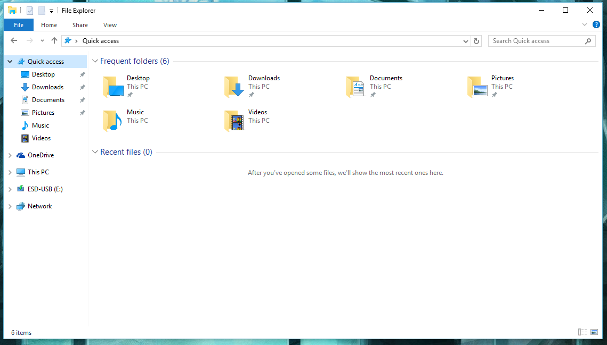
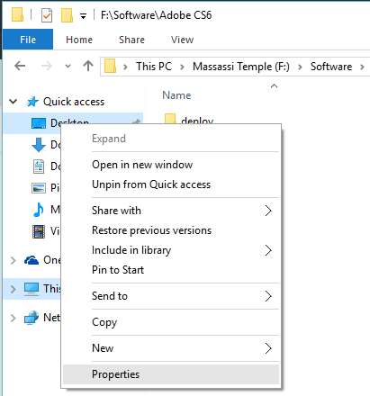
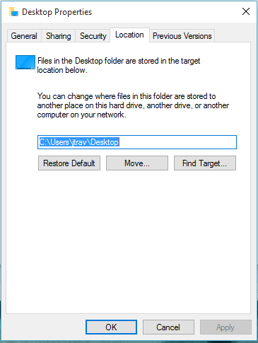

# Windows 10 Tricks

Documenting important/neat things I find when using Windows 10.

## Relocating Default Quick Access Folders

In Windows 10, the File Explorer has the same **quick access** folders as before. These locations are used as defaults for saving items by many applications in Windows. There are:

* Documents
* Pictures
* Music
* Videos
* Desktop

#### Scenario

By default, these save to `C:\Users\your_username_here\foldername\`. However, many PC owners use an SSD (or better) for their boot drive to increase the responsive-ness of Windows. It isn't uncommon to use older, magnetic hard drives for larger storage (as their storage:cost ratio is lower than the newer types of drives). 

#### Solution

You can change the location of each quick access item! In the **File Explorer**, *right-click* on Quick Access item. Select properties.

Inside of *Properties*, select the **Location** tab. You can *move* the location of where files are stored by default! Upon moving them, Windows will ask if you'd like to move files from your old folder to the new one. You should select **yes** (so all contents are kept together unless you want to do otherwise).

---

## Securing Your Computer

#### Scenario

You just installed Windows 10 and selected the default settings (because hey, why not?)... however, you've read about all the *creepy* things that Microsoft can track. You really can't trust anyone when it comes to the internet. Windows 10 **does track telemetry** but you can turn most of it off (including their built-in key/mouse logger). If you can live without Cortana, even better. Let's sit down and discuss how to 

#### Solution

- soon
- 

---
